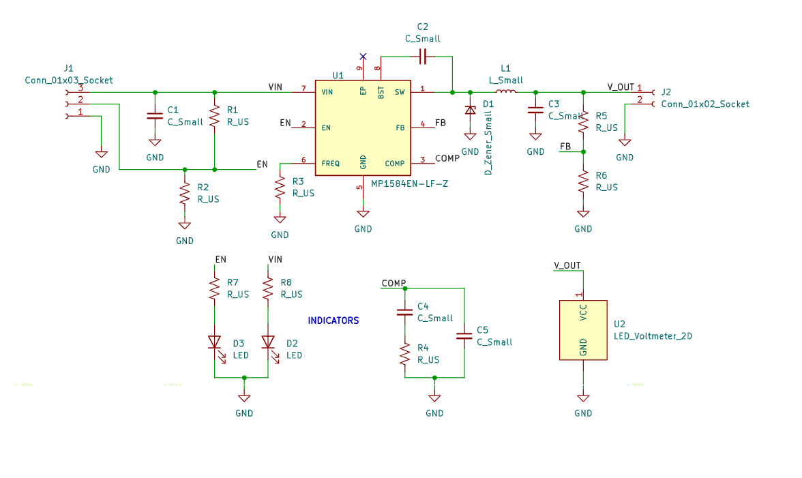

# BuckConverter Project

A KiCad-based Buck Converter (step-down voltage regulator) design project.



## Project Overview

This project contains the PCB design and simulations for a buck converter circuit. The design uses popular buck converter ICs (LM2596 or MP1584) for efficient DC-DC voltage step-down.


## Project Structure

```
BuckConverter/
├── main.kicad_pcb          # Main PCB layout file
├── main.kicad_sch         # Schematic file
├── main.kicad_pro         # KiCad project file
├── main.kicad_prl         # Project settings
├── main-backups/          # Automatic PCB backups
├── Datasheets/            # Component datasheets
│   ├── LM2596.PDF
│   └── MP1584.PDF
├── Docs/
│   └── Simulations/
│       └── schematic-simulations.pdf
├── Simulations/
│   └── Buck-converter-simulations.pdsprj  # Proteus simulation
├── Meter_Display_Footprints.pretty/        # Custom LED voltmeter footprint
└── .gitignore
```

## Tools & Software

- **PCB Design**: [KiCad EDA](https://www.kicad.org/) (version 8.x recommended)
- **Simulation**: Proteus (PCB layout simulation)
- **Components**:
  - LM2596 - Simple Buck Converter IC
  - MP1584 - High-efficiency Buck Converter IC

## Getting Started

1. Open the project in KiCad 8.x or later
2. Review the schematic in `main.kicad_sch`
3. Make modifications as needed
4. Run ERC (Electrical Rule Check) and DRC (Design Rule Check)
5. Generate manufacturing files (Gerber, Drill files)

## Simulations

Simulation files are located in the `Simulations/` directory. These contain circuit simulations demonstrating the buck converter behavior.

## Custom Footprints

Custom footprints for the LED voltmeter display are stored in:

- `Meter_Display_Footprints.pretty/`

## Version History

- Project created with KiCad 8.x
- Automatic backups enabled

## License

This project is for educational/hobbyist purposes. Follow component datasheet specifications for proper usage.
